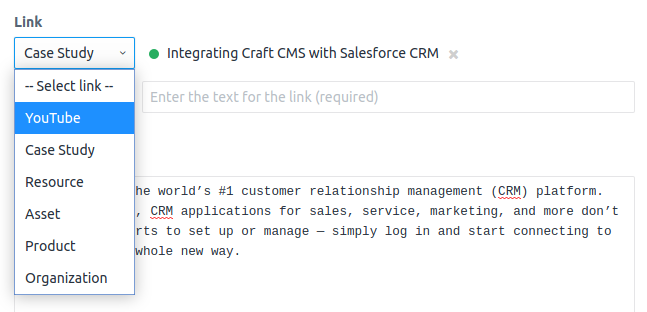
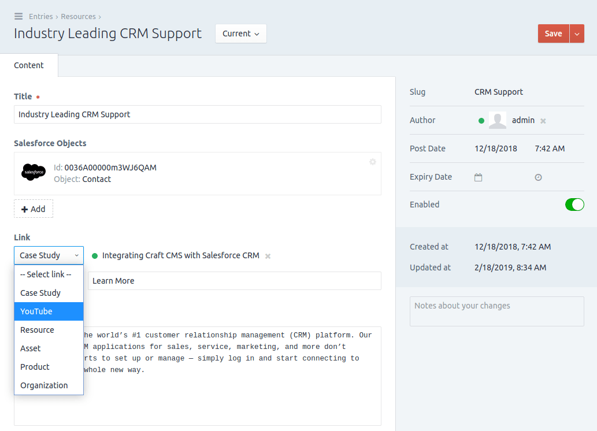
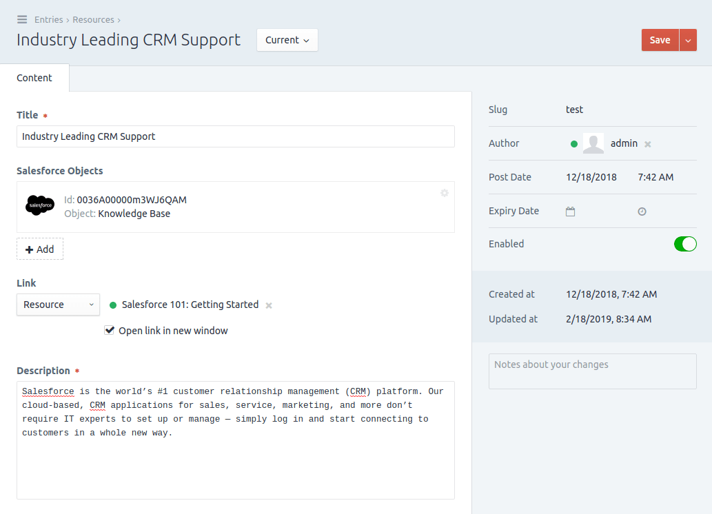
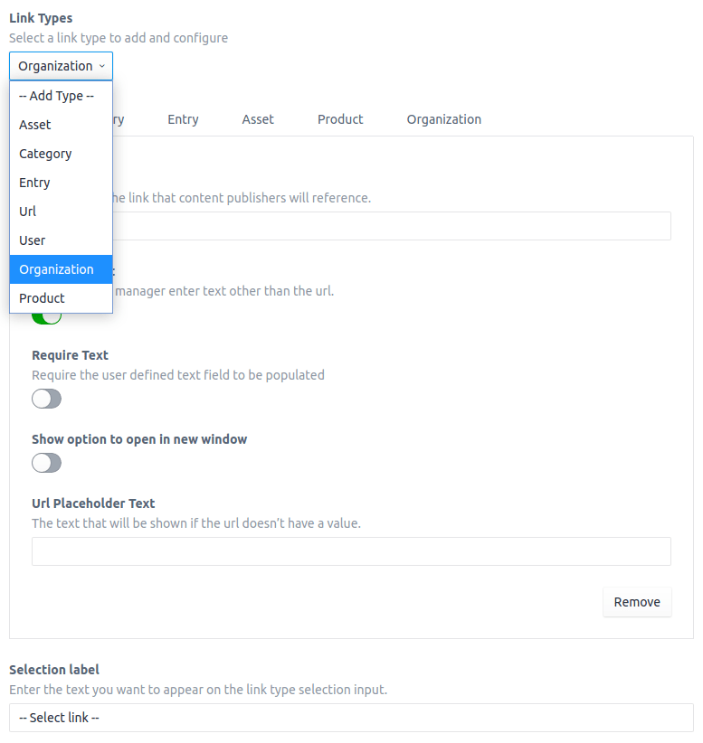

# Link Field Type for Craft CMS
[](https://gitter.im/flipboxfactory/craft-link?utm_source=badge&utm_medium=badge&utm_campaign=pr-badge&utm_content=badge)
[](https://github.com/flipboxfactory/craft-link/releases)
[](LICENSE.md)
[](https://travis-ci.org/flipboxfactory/craft-link)
[](https://scrutinizer-ci.com/g/flipboxfactory/craft-link)
[](https://packagist.org/packages/flipboxfactory/craft-link)

Link provides a robust field type for cross-content, external and various other link types.



## Requirements
This plugin requires Craft CMS 3.0 or later.

## Installation
Choose one of the following ways to add [Link] to your project:

1. Composer:

    Simply run the following command from your project root:

    ```
    composer require flipboxfactory/craft-link
    ```

2. Craft CMS Plugin Store:

    Within your Craft CMS project admin panel, navigate to the '[Plugin Store]' and search for '[Link]'. Installation is a button click away.


Once the plugin is included in your project, navigate to the Control Panel, go to Settings → Plugins and click the “Install” button for [Link].

Additional information (including pricing) can be found in the [Plugin Store].

## Features
[Link] is the most robust and configurable 'link' field type for Craft CMS.  Built with the content publisher in mind, [Link] is has an intuitive, easy to configure interface that enables admins to build
a field precisely to their requirements.   

Here are some of the features at a glance:
* Customizable labels
* Multiple link types per field
* Configurable settings per link-type
* Specify element sources to restrict available elements
* Add and link to new elements without leaving the page
* Simple rendering with overrides
* [Build your own custom link types](#third-party-link-types)


### Templating
The field value will either be `null` or an instance of [Link Type Interface].

Render a pre-constructed link:
```twig
{{ element.fieldHandle.getHtml()|raw }}
```

Render a pre-constructed link with overrides:
```twig
{{ element.fieldHandle.getHtml({
    text: 'Text Override'
})|raw }}
```

Render a pre-constructed link with additional attributes:
```twig
{{ element.fieldHandle.getHtml({
    class: "bg-blue hover:bg-blue-dark text-white font-bold py-2 px-4 rounded",
    rel: "noopener noreferrer",
    onclick: "return confirm('Are you sure?')"
})|raw }}
```

Build your own link:
```twig
<a href="{{ element.fieldHandle.url }}">{{ element.fieldHandle.text }}</a>
```

### Screenshots






### First Party Link Types
The following first party link types are supported:

* Element: Asset
* Element: Category
* Element: Entry
* Element: User
* HTTP/HTTPS

### Third Party Link Types
Including a custom link type is easy:
 
1. Create a new link type class.  The class must implement: `flipbox\craft\link\types\TypeInterface` (Ref: [Link Type Interface])
    
    _There are two abstract link types to help you get started:_
    * `\flipbox\craft\link\types\AbstractType` (Ref: [Abstract Link Type])
    * `\flipbox\craft\link\types\AbstractElement` (Ref: [Abstract Element Link Type])


2. Register the link type class.
    Example:
```php
\yii\base\Event::on(
    \flipbox\craft\link\Link::class,
    \flipbox\craft\link\Link::EVENT_REGISTER_TYPES,
    function(RegisterLinkTypes $event) {
        $event->types[] = YourLinkType::class; // Replace this with your link type class
    }
);
```

## Credits

- [Flipbox Digital](https://github.com/flipbox)

[Link Type Interface]: https://github.com/flipboxfactory/craft-link/blob/master/src/types/TypeInterface.php
[Plugin Store]: https://plugins.craftcms.com/link
[Link]: https://plugins.craftcms.com/link
[Abstract Link Type]: https://github.com/flipboxfactory/craft-link/blob/master/src/types/AbstractType.php
[Abstract Element Link Type]: https://github.com/flipboxfactory/craft-link/blob/master/src/types/AbstractElement.php